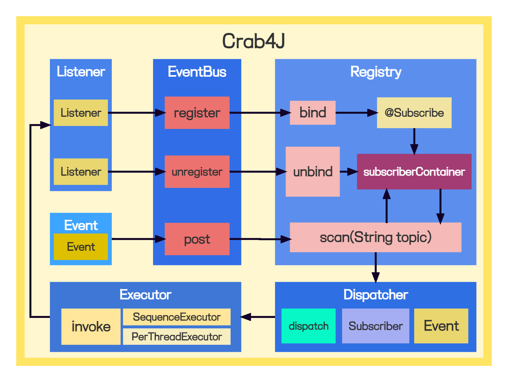

## 什么是 Crab4J？
- 一个基于事件发布与订阅的通用框架，主要提供事件注册、事件监听、事件广播、事件分发等功能。
- 分别使用两种不同的方法去实现。core 基础版无任何外部依赖，纯手撸；starter 版充分利用框架特性，开箱即用。

## 环境搭建
- 操作系统：Windows 10
- 集成开发工具：IntelliJ IDEA 2022.2.2
- 项目技术栈：JDK 1.8.0_321
- 项目依赖管理工具：Maven 3.6.3

## crab4j-core 基础版
### 项目架构


### 如何使用？
### 1.引入依赖
```xml
<dependency>
    <groupId>cn.crab4j</groupId>
    <artifactId>crab4j-core</artifactId>
    <version>${reversion}</version>
</dependency>
```
### 2.通过工具直接操作
```java
public class EventBusTest {

    @Test
    public void test_EventBus() {
        EventBusCenter.register(new SimpleListener());
        EventBusCenter.post("Uzi 来全杀了");
        for (int i = 0; i <= 4; i++) {
            EventBusCenter.post(new SimpleEvent("杀疯了"));
        }
        EventBusCenter.post(8848);

        EventBusCenter.close();
    }

    @Test
    public void test_EventBusUseTopic() {
        EventBusCenter.register(new SimpleListener());
        for (int i = 0; i < 10; i++) {
            EventBusCenter.post(new SimpleEvent("中下野辅，别坑我 Shy 哥"));
        }
        EventBusCenter.post("天神下凡", "my-topic");

        EventBusCenter.close();
    }

}
```